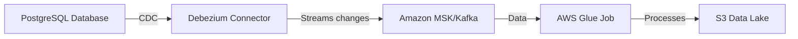

# Solution Architecture

## Overview
The solution implements a real-time data streaming pipeline using Debezium for Change Data Capture (CDC) from PostgreSQL to Apache Kafka, with data processing using AWS Glue.



## Components

### Local Development Environment (Docker Compose)
1. **PostgreSQL Database**
   - Source database where data changes are captured
   - Runs in a Docker container
   - Configured with logical replication for CDC

2. **Apache Kafka & Zookeeper**
   - Message broker for streaming data
   - Managed by Docker Compose
   - Stores change events from Debezium

3. **Debezium Connect**
   - CDC connector running in Docker
   - Monitors PostgreSQL WAL logs
   - Streams changes to Kafka topics

4. **Python Data Producer**
   - Generates sample data
   - Inserts records into PostgreSQL
   - Runs as a separate container

### AWS Cloud Environment (CloudFormation)
1. **Amazon Aurora PostgreSQL**
   - Managed PostgreSQL database
   - Configured with logical replication
   - Source for CDC operations

2. **Amazon MSK (Managed Streaming for Kafka)**
   - Fully managed Kafka service
   - Handles streaming data from Debezium
   - Configured with optimal instance types

3. **MSK Connect with Debezium**
   - Managed Debezium connector service
   - Integrates with Aurora PostgreSQL
   - Streams changes to MSK topics

4. **AWS Glue Job**
   - Python shell job for data processing
   - Code stored in S3 bucket
   - Processes data from MSK topics

5. **S3 Bucket**
   - Stores Python code for Glue job
   - Acts as a data lake for processed data
   - Provides durable storage

## Deployment Instructions

### Local Deployment
1. Ensure Docker and Docker Compose are installed
2. Clone the repository
3. Run `docker-compose up -d`
4. Execute setup script: `./scripts/setup.sh`
5. Monitor logs using `docker-compose logs -f`

### AWS Deployment
1. Prerequisites:
   - AWS CLI installed and configured
   - Necessary IAM permissions

2. CloudFormation Deployment:
   ```bash
   aws cloudformation create-stack \
       --stack-name debezium-stack \
       --template-body file://cloudformation.yaml \
       --capabilities CAPABILITY_IAM
   ```

3. Post-deployment:
   - Configure security groups
   - Set up Debezium connector in MSK Connect
   - Upload Python code to S3
   - Start Glue job

## Data Flow
1. Data changes in PostgreSQL trigger WAL events
2. Debezium captures changes and forwards to Kafka
3. Changes are streamed through MSK
4. Glue job processes the data
5. Results stored in S3 data lake

## Monitoring and Management
- Use CloudWatch for AWS service monitoring
- Docker logs for local environment
- MSK Connect dashboard for connector status
- Glue job logs for processing status